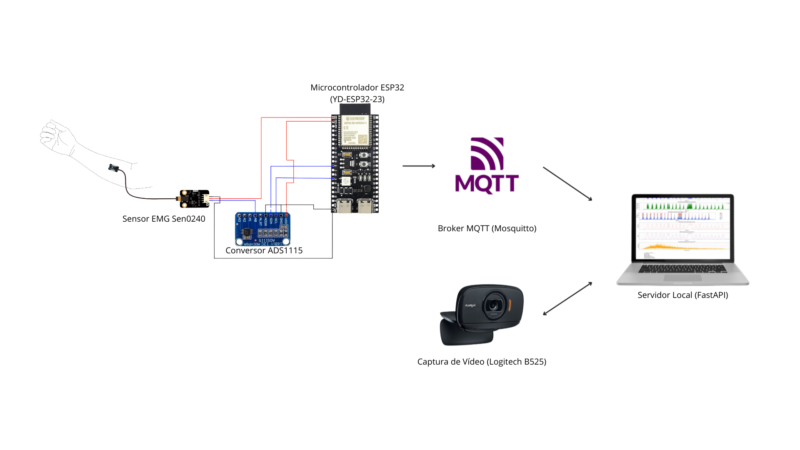
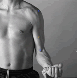
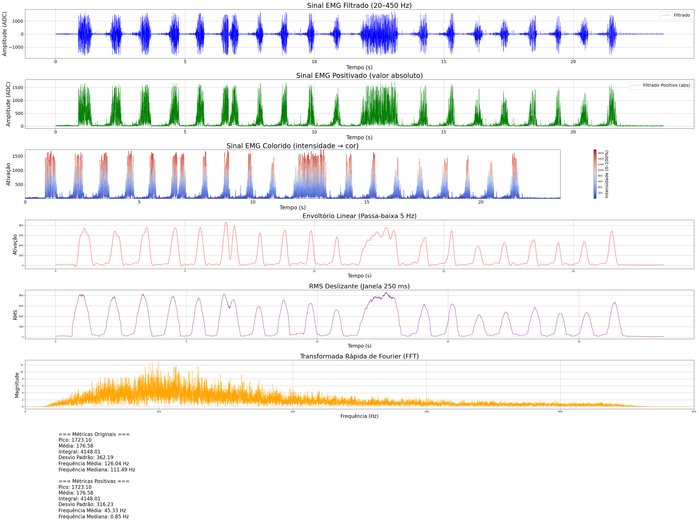

# TCC - Aquisição Multimodal com Hardware Limitado: EMG e Visão Computacional para Reabilitação.

## Introdução

Este repositório contém o Trabalho de Conclusão de Curso (TCC) desenvolvido no curso de Engenharia da Computação por Nicolas Sanson Giaboeski. O projeto propõe o desenvolvimento de um protótipo que integra leituras de um sensor de eletromiografia de superfície com técnicas de visão computacional (BlazePose) para apoiar decisões clínicas na reabilitação de pacientes.

## Descrição

O presente projeto tem como objetivo a prototipação de uma ferramenta de auxílio na tomada de decisão para profissionais da saúde, a qual oferecerá leituras de um sensor de eletromiografia de superfície aliado a técnicas de visão computacional para estimativas de angulações articulares. O protótipo é baseado no uso de um sensor de eletromiografia de superfície, um conversor AD, um microcontrolador ESP32 e um computador que serve como servidor local.

## Motivação

A reabilitação baseada em exercícios guiados pode ser cara ou exigir equipamentos especializados. O objetivo deste trabalho é proporcionar uma alternativa econômica e portátil que auxilie fisioterapeutas a monitorar a ativação muscular e a execução de movimentos, sendo um possível substituto para técnicas arcaicas utilizadas até hoje, como a goniometria.

## Objetivo Geral

Desenvolver um protótipo funcional que combine sinais de EMG e estimativas de pose para oferecer métricas e visualizações que auxiliem fisioterapeutas na avaliação de movimento e ativação muscular durante exercícios de reabilitação.

## Objetivos Específicos

- Projetar e implementar o firmware para aquisição e transmissão de sinais EMG a partir de um ESP32.
- Desenvolver um backend capaz de receber, processar e armazenar sinais EMG e dados de pose.
- Integrar um módulo de visão computacional (BlazePose) para estimativa de ângulos articulares.
- Criar uma interface simples para visualização e análise dos dados coletados.

## Descrição da Proposta

O sistema é composto por três camadas principais:

- Camada de aquisição (hardware/firmware): sensor EMG → conversor AD → ESP32 que amostra e transmite os dados via Broker MQTT (Mosquitto).
- Camada de processamento (backend): servidor que recebe os sinais EMG, executa filtragem, extração de features e correlaciona com as estimativas de pose vindas da câmera (BlazePose).
- Camada de apresentação (frontend): páginas web para visualização, histórico e exportação de dados.

O protótipo visa permitir treinamentos guiados, avaliações quantitativas de amplitude e ativação muscular, e a geração de relatórios básicos para suporte clínico.

## Principais Funcionalidades

- Aquisição contínua de sinais EMG e registro com carimbo de tempo.
- Estimativa de pose/ângulo articular via BlazePose e sincronização com sinais EMG.
- Visualização (gráficos de EMG e vídeo com ângulos).
- Armazenamento de sessões em um banco de dados para análise posterior.
- Exportação de dados (CSV) para análises externas.

## Tecnologias Utilizadas

- Hardware: ESP32 (YD-ESP32-23), conversor AD (ADS1115), sensor EMG de superfície (Sen0240)
- Firmware: C/C++ (PlatformIO/Arduino)
- Backend: Python (FastAPI)
- Visão Computacional: BlazePose (MediaPipe) integrado no módulo de processamento
- Frontend: HTML/CSS/JavaScript (pasta `front`)
- Banco de dados: PostgreSQL

## Requisitos

### Requisitos de Ambiente

- `Python` recomendado: versão 3.11 para suporte do MediaPipe
- `pip` para instalar dependências Python
- `PlatformIO` ou `Arduino IDE` para compilar/flash do `ESP32` (pasta `prj/esp_code`)


## Requisitos Funcionais

- O sistema deve ler sinais EMG a partir do microcontrolador.
- O backend deve sincronizar sinais EMG com estimativas de pose e salvar sessões.
- O frontend deve exibir gráficos e permitir exportação de dados.

## Requisitos Não-Funcionais

- Desempenho: taxa de amostragem adequada para EMG (configurada no firmware).
- Confiabilidade: tolerância a perda momentânea de pacotes e reconexão automática.
- Segurança: tratamento básico de dados sensíveis (não armazenar informações pessoais sem consentimento).

## Metodologia de Desenvolvimento

O desenvolvimento segue etapas iterativas:

1. Protótipo de hardware e leitura básica de EMG.
2. Implementação do firmware para transmissão de dados via MQTT.
3. Desenvolvimento do backend para ingestão e processamento.
4. Integração do módulo de visão computacional (BlazePose).
5. Criação do frontend para visualização e testes com usuários.
6. Ajustes e ensaios em clínicas.

## Esquemático da montagem



## Testes

- Testes de unidade para funções de processamento de sinal.
- Testes de integração entre ESP32 e backend.
- Comparação qualitativa com um aparelho de eletromiografia comercial em exercícios controlados.
- Verificação da eficiência quanto à possibilidade de substituição do goniômetro.

## Resultados Esperados

- Protótipo funcional capaz de correlacionar ativação muscular (EMG) com ângulos articulares estimados.
- Interface para visualização de sessões e exportação de dados.
- Base para desenvolvimento futuro (melhorias em algoritmos de detecção, ML, etc.).

## Conclusão

Espera-se que o protótipo sirva como uma ferramenta auxiliar acessível para fisioterapeutas, reduzindo custos de avaliação e fornecendo dados quantitativos que complementem técnicas tradicionais.

## Exemplo de posicionamento do sensor de eletromiografia de superfície

Todo e qualquer teste seguiu o padrão SENIAM.
Para o relatório seguinte, o sensor foi posicionado sobre o bíceps braquial, conforme a recomendação.



Outros referenciais podem ser encontrados em: https://www.seniam.org/

## Exemplo de Relatório Gerado



## Documentação

Toda a documentação e códigos encontram-se organizados nas pastas principais:

- `prj/esp_code/` — firmware e esquemáticos do protótipo.
- `prj/back/` — servidor e processamento.
- `prj/front/` — páginas web para visualização.
- `prj/hardware/` — informações técnicas sobre os componentes utilizados.
## Como Executar (Em adaptação)

1 - O primeiro passo é copiar o código e configurações presentes em `prj/esp_code/` e realizar upload para o ESP32. (Mudanças nas configurações podem ser necessárias, visto que o modelo de ESP utilizado não é comum)

2 - Clone os diretórios `prj/back/` e `prj/front/`.

3 - Em um terminal, acesse o diretório que você clonou os diretórios citados acima.

4 - Instale os pacotes necessários listados em `prj/back/requirements.txt`.

5 - Rode o servidor da aplicação web com o comando ```uvicorn server:app --host 0.0.0.0 --port 8000```

6 - Acesse a aplicação no seu navegador (127.0.0.1:8000)

7 - Com o ESP32 conectado no seu computador, aperte o botão "Configurar Aparelho" e preencha os campos de ssid e senha da rede Wi-Fi que será utilizada. Após isso, clique no botão de Reset do ESP e logo em seguida no botão de configurar na interface.

8 - Cadastre um paciente preenchendo os campos necessários e acesse o perfil desse paciente.

9 - Inicie uma nova coleta, escolhendo quais tipos de coleta você deseja realizar e a duração dessa coleta.
