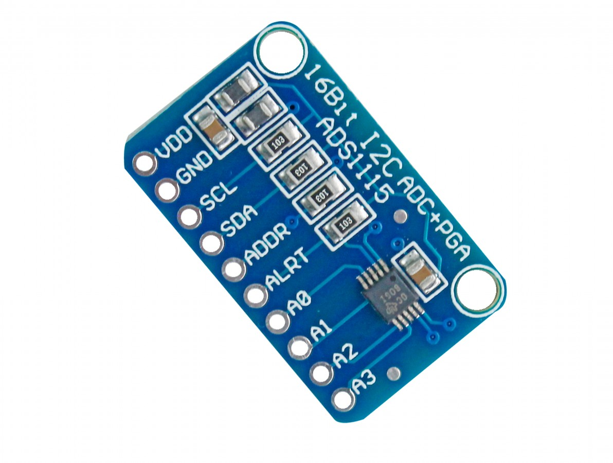

# ADS1115 — Conversor Analógico-Digital (ADC)



O ADS1115 é um conversor analógico-digital de alta resolução muito utilizado em sistemas embarcados quando é necessário medir sinais analógicos com precisão superior à oferecida pelos ADCs internos de microcontroladores.

# Dados Técnicos do ADS1115

| Característica     | Descrição                                   |
| ------------------ | ------------------------------------------- |
| Resolução          | 16 bits                                     |
| Canais             | 4 entradas (single-ended) ou 2 diferenciais |
| Interface          | I2C                                         |
| Tensão de Operação | 2.0V a 5.5V                                 |
| Taxa de Amostragem | 8 a 860 amostras por segundo (SPS)          |
| PGA                | Ganhos configuráveis (±6.144V até ±0.256V)  |
| Modo de Operação   | Single-shot ou contínuo                     |
| Consumo de Energia | Baixo, ideal para projetos com bateria      |

# Pinagem do ADS1115

| Pino      | Função       | Descrição                            |
| --------- | ------------ | ------------------------------------ |
| VCC       | Alimentação  | 2.0V a 5.5V                          |
| GND       | Terra        | Referência do circuito               |
| SDA       | Dados I2C    | Comunicação I2C                      |
| SCL       | Clock I2C    | Comunicação I2C                      |
| ADDR      | Endereço I2C | Define o endereço do dispositivo     |
| ALERT/RDY | Interrupção  | Sinaliza fim de conversão (opcional) |

# Componentes Necessários

* Módulo ADS1115
* Resistores pull-up (4.7kΩ–10kΩ) caso seu módulo não possua
* Fios jumper
* Fonte 3.3V ou 5V

# Recomendações

* **Endereço I2C**: Configure o pino ADDR conforme necessário. Endereços possíveis:

  * GND → 0x48
  * VCC → 0x49
  * SDA → 0x4A
  * SCL → 0x4B

* **PGA (Ganho)**: Selecione a faixa adequada do PGA para evitar saturação e maximizar resolução.

* **Taxa de Amostragem (SPS)**: Valores altos aumentam ruído; valores baixos aumentam sensibilidade.

* **Pull-ups I2C**: Caso o módulo não tenha resistores inclusos, utilize 4.7kΩ–10kΩ.

# Exemplo de Código (Arduino)

```cpp
#include <Wire.h>
#include "ADS1X15.h"

ADS1115 ADS(0x48);

void setup() {
  Serial.begin(115200);
  ADS.begin();
  ADS.setGain(0); // ±4.096V
}

void loop() {
  int16_t val_0 = ADS.getValue();
  float f = ADS.toVoltage(1);
  float valor = val_0 * f * 1000.0 // mV

  Serial.print("ADC0: ");
  Serial.print(val_0);
  Serial.print(" -> ");
  Serial.print(valor);
  Serial.println(" V");

  delay(500);
}
```

# Saída no Terminal

Exemplo de leitura contínua:

```
ADC0: 15723 -> 2949.53 mV
ADC0: 15801 -> 2964.66 mV
ADC0: 15765 -> 2957.34 mV
ADC0: 15712 -> 2947.48 mV
ADC0: 15820 -> 2968.22 mV
```

## Ligação com o YD-ESP32-23

1. Conecte VCC do ADS1115 a 3.3 V (preferível com ESP32) ou 5 V se seu módulo suportar e o barramento I2C tolerar.
2. Conecte GND → GND.
3. Conecte SDA → pin SDA do ESP32 (GPIO8).
4. Conecte SCL → pin SCL do ESP32 (GPIO9).
5. Ajuste ADDR conforme necessário para evitar conflito I2C (Conectado no ground para utilizar o 0x48).

Exemplo de fiação (ESP32 comum):

- ADS1115 VCC -> ESP32 3.3V
- ADS1115 GND -> ESP32 GND
- ADS1115 SDA -> ESP32 GPIO21
- ADS1115 SCL -> ESP32 GPIO22

Observação: alguns módulos incluem resistores pull-up; caso contrário, adicione pull-ups de 4.7k–10k em SDA e SCL.

Notas:
- Use a biblioteca `Adafruit_ADS1X15` para facilitar a configuração.
- O fator de conversão (LSB) depende do ganho configurado; consulte a documentação da biblioteca/ADS1115 para obter o valor correto.

## Limitações

- Apesar de 16 bits, a resolução efetiva pode ser bem menor dependendo do ruído e do condicionamento do sinal.
- Não é isolado galvanicamente; para medições em sistemas com referencia de terra diferente, tome cuidado com aterramento.

## Recursos / Referências

- Datasheet TI ADS1115: https://www.ti.com/product/ADS1115
- Biblioteca Adafruit ADS1X15: https://github.com/adafruit/Adafruit_ADS1X15

---
