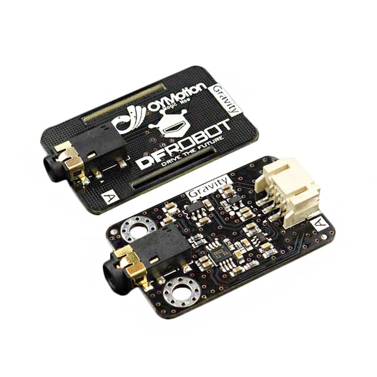

# SEN0240 — Sensor Analógico de EMG (OYMotion / DFRobot)

## Visão geral

O sensor SEN0240 (Analog EMG Sensor by OYMotion, SKU: SEN0240) é um módulo de aquisição analógica de sinais de eletromiografia (EMG) destinado a prototipagem e projetos educacionais. O módulo inclui um circuito de condicionamento (amplificação e filtragem básica) e fornece uma saída analógica proporcional à atividade elétrica muscular detectada pelos eletrodos.

Referência do fabricante: https://wiki.dfrobot.com/Analog_EMG_Sensor_by_OYMotion_SKU_SEN0240

## Características principais

- Saída analógica (única) pronta para leitura por ADC.
- Circuito de condicionamento embutido (ganho e filtragem básica).
- Compatível com microcontroladores (ESP32, Arduino) e ADCs externos (ADS1115, etc.).
- Alimentação típica: 3.3 V ou 5 V (verifique o módulo específico).
- Uso típico com eletrodos adesivos descartáveis ou eletrodos secos conforme aplicação.

> Observação importante: este sensor capta sinais biológicos (dados sensíveis). Use com cuidado, seguindo normas de segurança elétrica e ética. Não use o sensor em pacientes com dispositivos implantáveis (ex.: marca-passo) sem supervisão profissional.

## Pinout / conexões

- `VCC` — alimentação (3.3 V ou 5 V conforme módulo)
- `GND` — terra
- `OUT` — saída analógica com sinal EMG condicionado
- Possível pino `EN` ou `GAIN` em alguns módulos para habilitar ou ajustar ganho (ver o seu módulo)

## Ligação com ADS1115 + YD-ESP32-23

- SEN0240 VCC -> ESP32 3.3 V
- SEN0240 GND -> ESP32 GND
- SEN0240 OUT -> ADS1115 AIN0 (ou outra entrada ADC)
- ADS1115 SDA -> ESP32 SDA (GPIO8)
- ADS1115 SCL -> ESP32 SCL (GPIO9)
- ADS1115 VCC -> ESP32 3.3 V
- ADS1115 GND -> ESP32 GND

Dica: usar o ADS1115 em modo diferencial (por exemplo A0–A1) melhora rejeição de ruído para sinais pequenos; contudo, o SEN0240 entrega saída single-ended — para diferencial é necessário um segundo sinal de referência (por exemplo referência no Vmid).

## Considerações de amostragem

- EMG é um sinal com energia tipicamente entre 20 Hz e 450 Hz. Para análise robusta recomenda-se amostragem >= 1000 Hz para aplicações clínicas/analíticas.
- O `ADS1115` tem taxa máxima de ~860 SPS; isso pode ser insuficiente para aquisição EMG de alta fidelidade. Para protótipos simples, 250–500 SPS pode funcionar para deteção grossa de ativação muscular, mas limitará a análise de features de alta frequência.

## Condicionamento de sinal e filtragem

- O módulo SEN0240 já aplica ganho e filtragem básica; ainda assim, para melhores resultados considere:
  - Filtragem analógica: bandpass ~20–450 Hz (para remover DC e ruído de baixa frequência);
  - Notch (50/60 Hz) para reduzir interferência da rede elétrica, se presente;
  - Buffer de saída para isolar a carga do ADC se necessário.
- Em software: aplique filtragem digital (filtros passa-banda, média móvel, envelope ou filtro RMS) para extrair magnitude da ativação muscular.

## Boas práticas

- Use eletrodos limpos e bem posicionados; conexão ruim aumenta ruído.
- Posicione o sensor e aguarde um momento até que a temperatura do eletrodo suba, eletrodos frios tendem a não conduzir muito bem, gerando ruídos.
- Minimize loops de terra; mantenha terra comum entre sensor, ADC e microcontrolador.
- Proteja o paciente: verifique isolamento, e nunca conecte o sujeito a fontes de alto risco.

## Interpretação de sinais e processamento sugerido

- Pré-processamento: remover DC, aplicar filtro passa-banda e notch.
- Extração de features: RMS, envelope, média absoluta, tempo de ativação, frequência média.
- Para detecções simples, use limiar em RMS/envelope.

## Limitações e observações finais

- O SEN0240 é adequado para protótipos e estudos exploratórios, não substitui equipamentos médicos certificados para diagnóstico.
- Atenção às taxas de amostragem (ADS1115) e à resolução efetiva que o ruído impõe.

## Referências

- Página do produto / documentação: https://wiki.dfrobot.com/Analog_EMG_Sensor_by_OYMotion_SKU_SEN0240

---
