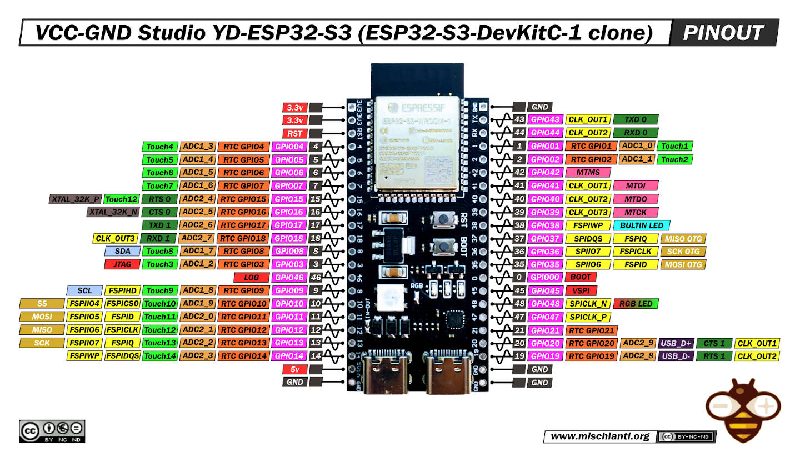

# YD-ESP32-23

Placa ESP32 usada no protótipo: YD-ESP32-23.

- Repositório / referência: https://github.com/rtek1000/YD-ESP32-23
- MCU: ESP32 (Wi‑Fi, Bluetooth)
- Tensão de operação recomendada: 3.3V
- Pinos I2C no protótipo: SDA = GPIO8, SCL = GPIO9

Uso rápido:
- Alimente a placa com 3.3V, conecte GND comum com sensores/ADC.
- Para I2C, conecte SDA/SCL conforme seu mapeamento.

Observação: consulte o repositório oficial para detalhes elétricos e exemplos de hardware.
